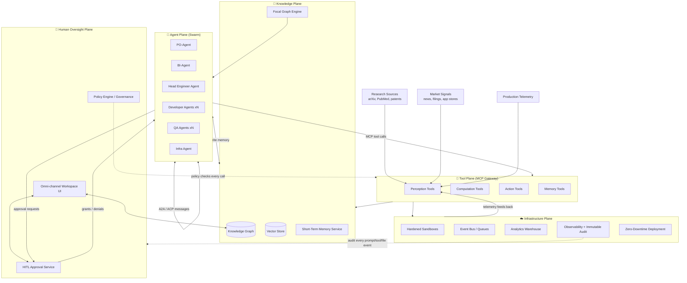

# Phase 0 — Planning

> RFC-001 · Section 0 · Status: Draft

This section is produced **before** the full RFC body, per the design process: table of
contents, architectural overview, subsystem identification, assumptions, risks, open
questions, and MVP-vs-Enterprise scoping. Everything in sections 1–12 elaborates what is
sketched here.

---

## 0.1 Table of Contents

1. **Architectural Philosophy** — Data-to-Product framework; continuous learning loops; multimodal knowledge integration; research→engineering transformation; Day 1 organizational philosophy; human-AI collaboration; Copilot Paradox mitigation; strategic human oversight.
2. **Swarm Multi-Agent Architecture** — PO/BI/Head-Engineer/Developer/QA/Infra agents; lifecycle; tool usage; memory access; failure recovery; retries; MCP vs ACP vs A2A; peer-to-peer coordination; sequence/orchestration/state diagrams.
3. **Tool Ecosystem** — MCP tool taxonomy (Perception, Computation, Action, Memory); research retrieval; AST analysis; code execution; deployment; graph/vector query; telemetry; market signals; API specifications.
4. **Knowledge Graph & Memory** — Dual memory (short-term: context/session/task; long-term: GraphRAG); entity/relationship extraction; ontology; citation/code/market/research graphs; Focal Graph generation (extraction, ranking, pruning, explainability); RAG vs GraphRAG vs Focal Graph; complexity & scalability; ER diagrams.
5. **Autonomous Software Engineering Workflow** — Agent-ready specs → AST → semantic indexing → dependency graphing → decomposition → blast radius → planning → codegen → test → validate → deploy → monitor → evolve; rollback/recovery; HITL points.
6. **Infrastructure** — Serverless analytics; BigQuery-like workspaces; Kubernetes; autoscaling; sandboxing; storage/compute separation; events/queues/caching; tracing/metrics/logs/alerts; Terraform/Pulumi organization.
7. **Security & Governance** — HITL checkpoints; policy engine; RBAC; secrets; sandboxing; prompt-injection mitigation; audit/provenance/chain-of-custody; model governance; threat model and mitigations.
8. **User Experience** — Omni-channel interface; focal graph visualization; swarm timeline; architecture review; research/code explorers; execution dashboard; 70/20/10 innovation dashboard; HITL approval UI.
9. **Database Design** — ERDs for 12 core entities; indexing; partitioning; scaling.
10. **APIs** — REST/gRPC/OpenAPI for 10 services with request/response examples.
11. **Repository Organization** — Monorepo layout; CI/CD organization.
12. **Phased Roadmap** — Phase 0 (Research) → 5 (Autonomous Research Platform); team size, duration, dependencies, debt, risk, milestones, metrics.

---

## 0.2 High-Level Architectural Overview

R2P-IP is organized as **five planes** — not a pipeline. Data and decisions circulate as
loops between planes; any plane can trigger work in any other.

**Core loop:** Perception ingests research/market/telemetry → Knowledge Plane fuses it
into the graph → BI/PO agents detect arbitrage opportunities → Head Engineer plans →
Developer/QA/Infra agents build, test, deploy inside sandboxes → telemetry from the
deployed product re-enters Perception. Humans gate strategy, ethics, and destructive
actions; the audit plane records everything.

---

## 0.3 Major Subsystems

| # | Subsystem | Responsibility | Key tech (recommended) |
|---|-----------|----------------|------------------------|
| S1 | Ingestion & Perception | Multimodal acquisition: papers, PDFs, market feeds, repos, telemetry | Connectors on queue workers, OCR/layout models, embedding pipelines |
| S2 | Knowledge Graph Service | Entity/relation store, ontology, graph algorithms | Property graph DB (Neo4j/Neptune) + columnar analytics mirror |
| S3 | Vector & Index Service | Embeddings, ANN search, semantic code index | pgvector → dedicated ANN (Qdrant/Vespa) at scale |
| S4 | GraphRAG / Focal Graph Engine | Community summarization, focal subgraph extraction, relevance ranking | Custom service over S2+S3 |
| S5 | Memory Service | Short-term (session/task) + long-term consolidation | Redis tier + graph-backed episodic store |
| S6 | Agent Runtime | Agent lifecycle, scheduling, supervision trees, retries | K8s operators + durable execution (Temporal) |
| S7 | Swarm Coordination | A2A discovery, contract-net bidding, ACP messaging | NATS JetStream + A2A protocol cards |
| S8 | MCP Tool Gateway | Single choke point for all tool calls; policy + audit + quota | Custom gateway, OPA sidecar |
| S9 | Planning & Execution Service | Spec → task DAG → blast radius → execution plans | Deterministic planner + Temporal workflows |
| S10 | Code Intelligence | AST parsing, dependency graphs, semantic diff, blast radius | tree-sitter, SCIP/LSIF indexes |
| S11 | Sandbox Execution | Hardened ephemeral build/test/run environments | Firecracker microVMs (gVisor fallback) |
| S12 | Deployment & Release | Progressive delivery, zero-downtime, rollback | Argo CD + Argo Rollouts, feature flags |
| S13 | Analytics Warehouse | TB-scale workspace analytics, experiment data | BigQuery / Snowflake-class, Iceberg on object storage |
| S14 | Governance & Security | Policy engine, RBAC, secrets, HITL, model governance | OPA/Cedar, Vault, approval workflows |
| S15 | Audit & Provenance | Immutable logs of prompts/tools/files; chain-of-custody | Append-only event store + hash chaining (QLDB-style) |
| S16 | Experience Layer | Web app, graph viz, dashboards, notifications, chat-ops | Next.js, WebGL graph rendering, websocket event streams |

---

## 0.4 Major Design Assumptions

| ID | Assumption | If false → |
|----|-----------|------------|
| A1 | Frontier LLMs (Fable/Opus class) remain accessible via API with tool-calling and ≥200k context | Self-hosted OSS models; degrade autonomy level |
| A2 | MCP remains the dominant tool-integration standard; A2A/ACP mature for inter-agent comms | Wrap protocols behind internal abstraction (we do this anyway) |
| A3 | Agent-written code quality reaches "mergeable with review" for routine tasks | Shift ratio toward human authorship; platform still valuable as intelligence layer |
| A4 | Research sources (arXiv, PubMed, patents, market data) permit programmatic ingestion under license | Licensing budget; partner feeds; reduced corpus |
| A5 | Customers accept SaaS with strong tenancy isolation; some need VPC/self-hosted later | Design for single-tenant deployability from Day 1 (we do) |
| A6 | Graph + vector hybrid retrieval outperforms pure vector RAG for cross-domain synthesis | Focal Graph degrades to community-summary GraphRAG; still ≥ RAG baseline |
| A7 | Token economics keep cost-per-merged-change below human-hour cost for routine tasks | Cache aggressively, route small models, batch; raise autonomy threshold |
| A8 | Deterministic orchestration (workflow engine) + stochastic agents is the right split | Already the safest assumption; inverse (agents orchestrate everything) is the risky one |

---

## 0.5 Architectural Risks

| ID | Risk | Likelihood | Impact | Mitigation (section) |
|----|------|-----------:|-------:|----------------------|
| R1 | **Compounding agent error** — multi-step plans amplify small mistakes | High | High | Deterministic workflow spine, per-stage validation gates, blast-radius caps (§5) |
| R2 | **Prompt injection via ingested research/web content** | High | Critical | Taint tracking, instruction/data separation, tool firewall, no ambient creds (§7) |
| R3 | **Knowledge graph pollution / data poisoning** | Medium | High | Provenance scoring, quarantine tier, human curation queues (§4, §7) |
| R4 | **Cost blowout** (LLM tokens + graph compute) | High | Medium | Budget governor per task, model routing, focal-graph token reduction (§4, §6) |
| R5 | **Copilot Paradox** — humans rubber-stamp agent output, skill atrophy | Medium | High | Structured review artifacts, dissent prompts, review sampling, explainability UI (§1, §8) |
| R6 | **Graph scalability** — entity resolution and community detection at TB scale | Medium | Medium | Partitioned graph, incremental Leiden, tiered summarization (§4, §9) |
| R7 | **Vendor/model lock-in** | Medium | Medium | Provider-agnostic gateway, eval harness for model swaps (§7 model governance) |
| R8 | **Sandbox escape** | Low | Critical | MicroVM isolation, egress allowlists, no secrets in sandbox (§6, §7) |
| R9 | **Regulatory exposure** (autonomous changes to production, AI governance laws) | Medium | High | Immutable audit, chain-of-custody, deployment HITL gates, EU AI Act alignment (§7) |
| R10 | **Coordination thrash** — swarm deadlock/livelock, duplicated work | Medium | Medium | Contract-net with leases, idempotent tasks, supervisor arbitration (§2) |

---

## 0.6 Open Questions Requiring Future Validation

1. **OQ-1 Focal Graph ranking:** Does personalized-PageRank + semantic re-ranking beat learned GNN ranking on our synthesis benchmarks? (Validate Phase 1 with offline evals.)
2. **OQ-2 Autonomy threshold:** What change-risk score reliably separates "auto-merge" from "human review"? Needs calibration data from Internal Alpha.
3. **OQ-3 A2A maturity:** Is the A2A protocol stable enough for cross-org agent federation, or do we keep it internal-only until Enterprise phase?
4. **OQ-4 Entity resolution quality:** Acceptable precision/recall for cross-domain entity merging (paper-author vs code-author vs market-company)? Target ≥0.95 precision before auto-merge.
5. **OQ-5 Economic unit:** Is cost-per-merged-PR or cost-per-validated-insight the right unit economics anchor for pricing?
6. **OQ-6 Memory consolidation cadence:** Continuous vs nightly episodic→semantic consolidation — latency vs consistency trade-off.
7. **OQ-7 Multi-tenant graph isolation:** Logical partition (label-based) vs physical (DB-per-tenant) at what tenant size? Default: logical for SMB, physical for Enterprise.
8. **OQ-8 Research licensing:** Which corpora can legally feed a commercial product-generation engine, and with what attribution chain?

---

## 0.7 MVP Scope vs Enterprise Scope

| Dimension | MVP (Phase 1, ~6 months) | Enterprise (Phase 4+) |
|-----------|--------------------------|------------------------|
| Agents | PO, Head Engineer, 2× Developer, QA (single-tenant, fixed roster) | Full swarm incl. BI + Infra, elastic roster, custom agent definitions |
| Coordination | Centralized orchestrator calling agents (star topology) | Decentralized A2A contract-net with supervisor arbitration |
| Memory | Vector RAG + lightweight entity graph | Full GraphRAG + Focal Graph engine + episodic consolidation |
| Research ingest | arXiv + GitHub + 1 market feed | 20+ connectors, patents, filings, custom enterprise corpora |
| Codegen targets | One stack (TypeScript/Next.js services), greenfield repos | Polyglot, brownfield repos, monorepo-aware blast radius |
| HITL | Approve every deploy + every destructive op | Risk-scored gates; auto-merge below threshold, sampled review |
| Tenancy | Single tenant (design multi-tenant-ready schemas) | Full multi-tenant + VPC/self-hosted option |
| Sandbox | gVisor containers, egress allowlist | Firecracker microVMs, per-tenant network policy, attestation |
| Audit | Append-only Postgres event log | Hash-chained immutable ledger, compliance exports (SOC 2, ISO 42001) |
| UI | Graph viewer, task board, approval inbox | Full omni-channel suite incl. innovation dashboard, chat-ops |
| Scale | ≤100 GB graph+vectors, 10 concurrent agents | TB-scale, 1000+ concurrent agents, federated deployments |
| Deployment | Single region, blue/green | Multi-region, cell-based, zero-downtime everywhere |

**MVP thesis to prove:** *given a research corpus and a product hypothesis, the platform
can produce a deployed, tested service with full audit trail and human approval gates,
faster than a two-pizza team — while the knowledge graph demonstrably improves agent
output versus plain RAG.* Everything not serving that thesis is deferred.

---

*Proceed to [Section 1 — Architectural Philosophy](01-philosophy.md).*
