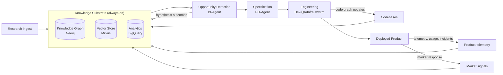

# Phase 1 — Architectural Philosophy

> RFC-001 · Section 1 · Status: Draft

## 1.1 Data-to-Product, Not Pipeline

A linear pipeline (`ingest → analyze → spec → build → ship`) is the obvious design and
the wrong one. Pipelines assume the value of information is known at ingestion time and
flows one direction. Research-to-product value is *latent*: a 2019 materials-science
paper becomes valuable only when a 2026 market signal and a telemetry anomaly intersect
with it. R2P-IP is therefore designed as a **Data-to-Product field**: a persistent,
continuously enriched knowledge substrate (the graph) over which opportunistic processes
(agents) operate in loops.



### Why not a pipeline — explicit trade-off

| Criterion | Linear pipeline | Data-to-Product field (chosen) |
|---|---|---|
| Latent cross-domain discovery | Poor — stages only see upstream output | Strong — graph holds all domains simultaneously |
| Failure isolation | Stage failure stalls everything | Loops degrade independently |
| Cost | Lower (predictable batch) | Higher (always-on substrate) — mitigated by tiered storage |
| Reasoning auditability | Easy (stage logs) | Harder — requires explicit provenance edges (we mandate them) |
| Time-to-first-demo | Faster | Slower — why the MVP runs a *thin* loop over a *small* substrate |

**Decision:** field architecture, with a deterministic workflow spine (Temporal) *inside*
the engineering loop so that the stochastic part (discovery) and the deterministic part
(delivery) each get the structure they need.

## 1.2 Continuous Learning Loops

Four loops run at different cadences. Each loop writes its outcome back to the graph, so
the substrate is the integration point — loops never call each other directly.

| Loop | Cadence | Input | Output written to graph |
|---|---|---|---|
| **Perception loop** | minutes–hours | New papers, signals, telemetry | Entities, relations, embeddings, provenance |
| **Insight loop** | hours–days | Graph deltas | Hypotheses (A–B–C Swanson links), opportunity scores |
| **Engineering loop** | hours–days | Approved specs | Code graph deltas, test results, deploy records |
| **Evolution loop** | days–weeks | Telemetry vs. spec intent | Improvement tasks, deprecation proposals, post-mortems |

The critical property is **closure**: every loop's output is a first-class graph citizen
that the other loops can perceive. A failed hypothesis is as valuable as a confirmed one
— it prunes future search.

## 1.3 Multimodal Knowledge Integration

Modalities are normalized into one ontology (§4) but retain modality-specific structure:

- **Text** (papers, filings): chunked + embedded + entity-extracted; layout-aware parsing for PDFs (tables, figures, equations preserved as typed nodes).
- **Code**: AST-level parse (tree-sitter), symbol graph (SCIP), semantic embeddings per symbol — *not* per file.
- **Tabular/telemetry**: lands in BigQuery; aggregates and anomalies are promoted into the graph as `MarketSignal`/`TelemetryEvent` nodes, raw data stays in the warehouse.
- **Figures/diagrams**: vision-model captioning → caption embeddings + extracted entities linked to source figure.

**Rule: the graph stores claims and links; the warehouse stores bulk; the vector store
stores meaning.** No subsystem duplicates another's job — this is what keeps TB-scale
tractable (§4.6, §9).

## 1.4 Research → Engineering Transformation

The transformation has a single contract artifact: the **Agent-Ready Specification
(ARS)** (§5.1). Research never flows into code generation directly. The chain is:

```
ResearchPaper ──cites/supports──▶ Hypothesis ──validated-by──▶ Insight
Insight + MarketSignal ──▶ Opportunity ──HITL approval──▶ ARS ──▶ Task DAG ──▶ Code
```

Every code artifact carries provenance edges back to the papers and signals that
motivated it. This gives us: (a) explainability ("why does this feature exist?"),
(b) reproducible research (re-run the chain), (c) licensing audit (which corpus
influenced which product).

## 1.5 Day 1 Organizational Philosophy

The platform is the org chart. Day 1 principles:

1. **Humans own *why*, agents own *how*, the graph owns *what we know*.**
2. **Two-way-door bias:** agents act autonomously on reversible decisions; one-way doors (deletes, deploys, external publication, spend) require HITL. The policy engine encodes the door classification — it is not left to agent judgment.
3. **Working backwards:** every Opportunity is written as a one-page PR/FAQ by the PO-Agent before any task decomposition. Humans approve the narrative, not the diff.
4. **Disagree-and-commit is mechanized:** QA and Developer agents are *required* to file dissent artifacts when validation is ambiguous; the Head Engineer arbitrates; unresolved dissent escalates to humans.
5. **Everything is an API; every API is audited.**

## 1.6 Human-AI Collaboration Model

Three human roles map to platform surfaces:

| Role | Owns | Platform surface |
|---|---|---|
| **Strategist** (founder/PM) | Opportunity selection, 70/20/10 portfolio, ethics | Innovation dashboard, opportunity inbox |
| **Architect** (Staff eng) | ARS approval, architecture review, blast-radius overrides | Architecture review workflow, code explorer |
| **Operator** (SRE/on-call) | Deploy gates, incident response, rollback authority | Execution dashboard, approval inbox |

Autonomy is graduated per task by a **risk score** `R = f(blast_radius, reversibility,
data_sensitivity, novelty)`:

| R | Mode | Human involvement |
|---|---|---|
| 0–0.2 | Autonomous | Post-hoc sampled review (≥5%) |
| 0.2–0.5 | Supervised | Async approval of plan, not diff |
| 0.5–0.8 | Collaborative | Human approves plan + reviews diff |
| 0.8–1.0 | Human-led | Agent assists; human authors decision |

## 1.7 Mitigating the Copilot Paradox

The Copilot Paradox: as automation quality rises, human review attention falls exactly
when residual errors become subtler and more dangerous. Mitigations are structural, not
exhortative:

1. **Review artifacts, not diffs.** Agents must produce a *claims sheet*: "this change does X, cannot affect Y, was tested by Z." Humans verify claims; the platform verifies the claims sheet against the blast-radius analysis mechanically. Reviewing claims is cognitively cheaper and catches more than scanning 400-line diffs.
2. **Calibrated trust dial.** Auto-merge thresholds are set from measured defect-escape rates per agent per task-class, recomputed weekly — never set by vibes.
3. **Deliberate friction on one-way doors.** Destructive approvals require typed confirmation of the *consequence*, not a button click.
4. **Adversarial sampling.** A red-team QA agent periodically plants seeded defects in review queues; reviewer catch-rate is tracked. Falling catch-rate triggers autonomy downgrade — the system slows down when humans stop paying attention.
5. **Skill preservation.** 70/20/10 portfolio (§8.7) reserves the 10% experimental track for human-led builds, keeping architect skills exercised.

## 1.8 Strategic Role of Human Oversight

Humans are not a fallback error handler; they are the **objective function**. Agents
optimize within constraints; humans set constraints, choose among Pareto-optimal
options, and own ethical/legal judgment. Concretely, humans are irreplaceable at:
opportunity portfolio selection, ARS intent approval, autonomy-threshold governance,
incident command, and model-governance sign-off (§7.11). Everything else is delegable
in principle and delegated progressively in practice (roadmap, §12).

---

*Next: [Section 2 — Swarm Multi-Agent Architecture](02-swarm-architecture.md)*
