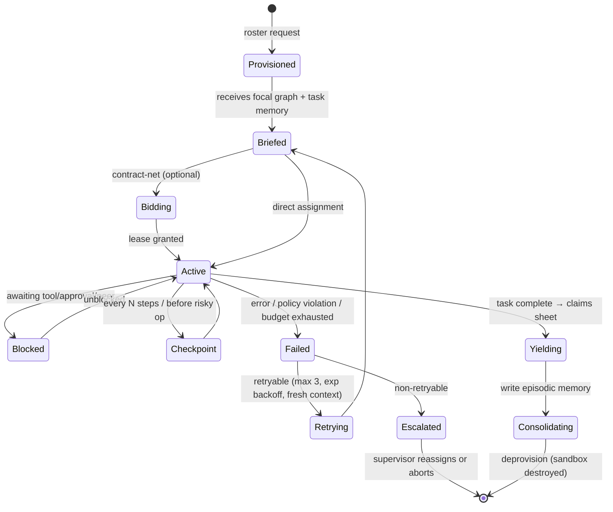
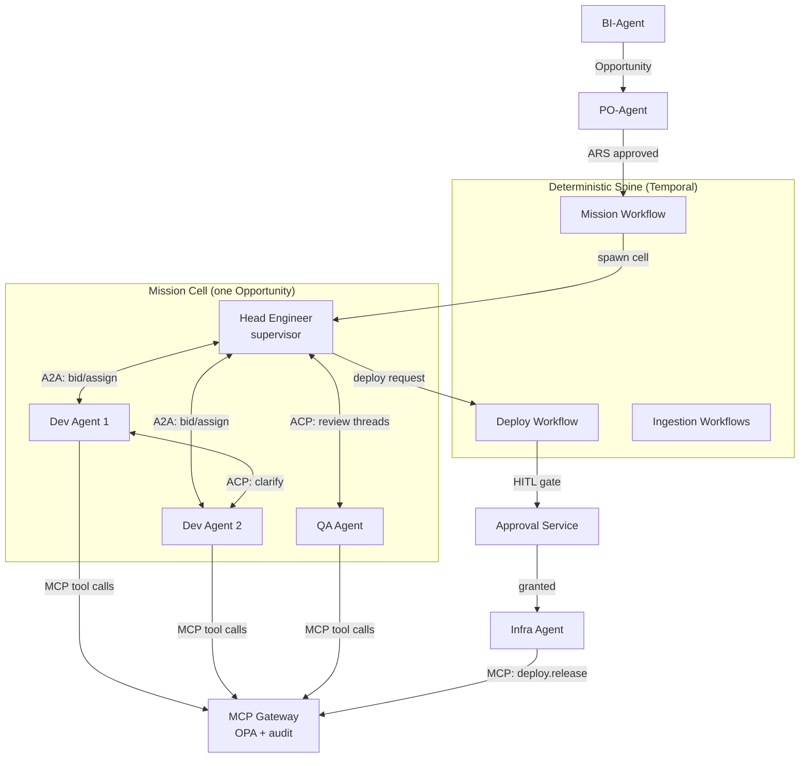
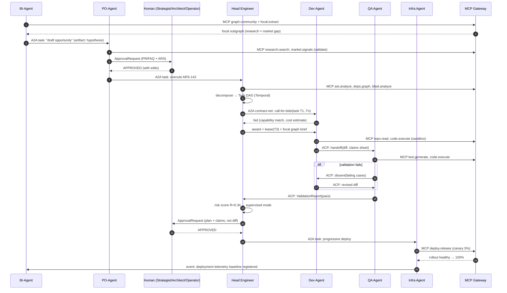

# Phase 2 — Swarm Multi-Agent Architecture

> RFC-001 · Section 2 · Status: Draft

## 2.1 Topology Decision

| Option | Pros | Cons | Verdict |
|---|---|---|---|
| Central orchestrator (star) | Simple, debuggable, cheap | Single point of failure; orchestrator context becomes bottleneck | MVP only |
| Hierarchical (supervisor trees) | Failure containment, clear escalation | Rigid; cross-team work routes through roots | Component of final design |
| Pure peer-to-peer mesh | Maximal parallelism, resilient | Coordination thrash, hard to audit, emergent deadlock | Rejected as sole model |
| **Hybrid: supervised swarm (chosen)** | P2P within a mission, supervisor per mission, deterministic spine | Most moving parts | **Recommended** |

**Chosen model:** each *mission* (one Opportunity → product increment) gets a
**mission cell**: a Head Engineer Agent as supervisor plus a dynamic roster recruited
via contract-net bidding. Inside the cell, agents coordinate peer-to-peer (A2A);
across cells and to the platform, everything flows through Temporal workflows and the
MCP gateway. Determinism where money and safety live; autonomy where creativity lives.

## 2.2 Agent Roster

| Agent | Mission role | Primary tools (MCP) | Memory access | Escalates to |
|---|---|---|---|---|
| **PO-Agent** | Convert opportunities into PR/FAQ + Agent-Ready Specs; own acceptance criteria; arbitrate scope | `research.search`, `graph.query`, `focal.extract`, `market.signals`, `spec.validate` | Read: full graph. Write: Opportunity, ARS nodes | Human Strategist |
| **BI-Agent** | Mine graph for arbitrage: Swanson A–B–C links, structural holes, market-research intersections; score opportunities | `graph.query`, `graph.community`, `focal.extract`, `market.signals`, `warehouse.sql`, `vector.search` | Read: full graph + warehouse. Write: Hypothesis, Opportunity nodes | PO-Agent |
| **Head Engineer Agent** | Decompose ARS into task DAG; blast-radius analysis; assign via contract-net; arbitrate dissent; own merge decisions below autonomy threshold | `ast.analyze`, `deps.graph`, `blast.analyze`, `plan.create`, `task.assign`, `code.review` | Read: code graph + ARS + team episodic memory. Write: Task, ExecutionPlan | Human Architect |
| **Developer Agent** (xN) | Implement tasks: codegen, refactor, write unit tests; self-review before handoff | `repo.read/write`, `ast.analyze`, `code.execute` (sandbox), `vector.code_search`, `deps.graph` | Read: focal graph for task. Write: CodeBlock, task memory | Head Engineer |
| **QA Agent** (xN) | Generate integration/property tests; mutation testing; verify claims sheets; file dissent | `code.execute`, `test.generate`, `test.mutate`, `telemetry.query`, `spec.validate` | Read: ARS + diff + test history. Write: ValidationReport | Head Engineer |
| **Infra Agent** | Provision environments; progressive deploys; monitor rollouts; execute rollbacks; manage cost budgets | `infra.plan/apply` (gated), `deploy.release`, `deploy.rollback`, `telemetry.query`, `k8s.inspect` | Read: infra graph + runbooks. Write: DeploymentRecord | Human Operator |

## 2.3 Agent Lifecycle

Every agent instance is a supervised, checkpointed process (Python/FastAPI worker on
GKE, state in Temporal + Postgres).

Key lifecycle rules:

- **Lease-based work claims.** A task lease (default 30 min, heartbeat-extended) prevents two agents claiming the same task; expired lease → task returns to queue. Prevents both deadlock and duplicate work.
- **Checkpointing.** Agent state (conversation summary, scratchpad, tool ledger) checkpoints to Postgres before any Action-class tool call, so retry resumes after the last safe point rather than replaying side effects.
- **Fresh-context retry.** Retries get a *summarized* brief, not the failed transcript — empirically avoids repeating the same reasoning failure.
- **Budget governor.** Each instance carries token/CPU/wallclock budgets; exhaustion → checkpoint + escalate, never silent overrun.

## 2.4 Failure Recovery Matrix

| Failure | Detection | Recovery |
|---|---|---|
| Agent crash (pod OOM, etc.) | Temporal heartbeat timeout | Respawn from checkpoint, same lease |
| Hallucinated tool args | MCP gateway schema validation | Reject + structured error → agent self-corrects (3 strikes → escalate) |
| Repeated task failure | Retry counter | Escalate to supervisor with failure digest; supervisor re-plans or re-scopes |
| Policy violation attempt | OPA decision at gateway | Hard block, audit event, supervisor notified; repeated → instance quarantined |
| Supervisor (Head Eng) failure | Mission heartbeat | Standby supervisor adopts mission from Temporal state |
| Swarm livelock (bid storm) | Coordination metrics (bids/sec, reassign rate) | Circuit breaker switches cell to direct-assignment mode |
| Conflicting concurrent edits | Git merge conflict in integration branch | Head Engineer rebases/re-serializes affected tasks |

## 2.5 Communication Protocols: MCP vs ACP vs A2A

| Protocol | Layer | Use in R2P-IP | When to use |
|---|---|---|---|
| **MCP** (Model Context Protocol) | Agent ↔ tools/resources | ALL access to data and side effects: graph queries, code exec, deploys. Single gateway, policy-checked, audited | Whenever an agent touches anything that is not another agent. Never used agent-to-agent |
| **A2A** (Agent2Agent) | Agent ↔ agent, capability discovery + task delegation | Agent Cards advertise capabilities; contract-net bidding; cross-cell delegation; future cross-org federation | Discovering *who* can do work and delegating long-lived tasks with artifacts |
| **ACP** (Agent Communication Protocol) | Agent ↔ agent, conversational/multipart messaging | Intra-cell peer dialogue: review threads, dissent filings, clarification rounds (REST-native, MIME multipart fits diff+claims-sheet payloads) | Rich peer conversation *within* an established collaboration |

**Rule of thumb:** *MCP for the world, A2A to find and commission peers, ACP to talk
with them.* All three ride NATS JetStream internally (durable, ordered, replayable);
A2A/ACP semantics are envelope formats over the bus, so the audit plane taps one stream.

## 2.6 Orchestration Diagram

## 2.7 Message Flow — Opportunity to Deployed Change

## 2.8 Coordination Mechanics

- **Contract-net bidding:** Head Engineer broadcasts `call-for-bids` with task descriptor (skills, estimated complexity, focal-graph pointer). Idle Developer agents respond with structured bids (self-assessed capability score from past task-class performance + current load). Award = argmax(capability × availability / cost). Ties broken deterministically (task hash) to keep replays reproducible.
- **Dissent protocol:** any agent may file `dissent(artifact, reason, evidence)` via ACP. Dissent blocks merge until supervisor resolution; resolutions are graph-recorded and feed agent calibration.
- **Gossip is forbidden.** No agent-to-agent state sharing outside recorded A2A/ACP messages — shared state lives only in the graph and task memory. This single rule is what keeps the swarm auditable.

---

*Next: [Section 3 — Tool Ecosystem](03-tool-ecosystem.md)*
