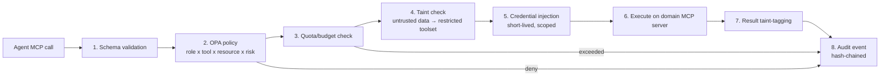

# Phase 3 — Tool Ecosystem (MCP)

> RFC-001 · Section 3 · Status: Draft

All agent capabilities are expressed as MCP tools served by domain MCP servers behind a
single **MCP Gateway** (Go). The gateway is the only network path from agents to the
world: it validates schemas, evaluates OPA policy, enforces quotas, injects short-lived
credentials, and emits one audit event per call. Tools are classified into four
families; the family determines default policy.

| Family | Side effects | Default policy | Examples |
|---|---|---|---|
| **Perception** | None (read external/internal data) | Allow + rate limit | research retrieval, market signals, telemetry |
| **Computation** | None outside sandbox | Allow in sandbox | AST analysis, code execution, test runs |
| **Action** | Yes (world-changing) | Policy check; HITL if destructive | repo write, deploy, infra apply |
| **Memory** | Writes to knowledge substrate | Provenance required | graph write, vector upsert, episodic store |

## 3.1 Tool Catalog

### Perception

| Tool | Purpose | Backed by |
|---|---|---|
| `research.search` | Hybrid search over papers (BM25 + vector + graph expansion) | Milvus + Neo4j + BigQuery |
| `research.fetch` | Retrieve full parsed paper (sections, figures, tables, citations) | Object store + parse cache |
| `market.signals` | Query market events (funding, filings, launches, pricing) | Signal warehouse (BigQuery) |
| `telemetry.query` | Metrics/logs/traces for deployed products | Datadog API + BigQuery export |
| `web.fetch` | Sandboxed, taint-tagged web retrieval | Egress proxy (allowlisted) |
| `repo.read` | Read files/history from indexed repos | Git mirror service |

### Computation

| Tool | Purpose | Backed by |
|---|---|---|
| `ast.analyze` | Parse files → AST, symbols, complexity metrics | tree-sitter service (Rust) |
| `deps.graph` | Dependency/call graph for a symbol set | SCIP index |
| `blast.analyze` | Blast-radius: affected symbols/services/tests for a proposed change | Code graph + ownership map |
| `code.execute` | Run code/tests in ephemeral sandbox; returns stdout/exit/artifacts | gVisor (MVP) → Firecracker |
| `test.generate` / `test.mutate` | Synthesize tests; mutation-test a diff | Sandbox + coverage service |
| `warehouse.sql` | Read-only SQL over analytics workspace | BigQuery (per-tenant dataset, byte quota) |
| `spec.validate` | Lint an ARS for completeness/contradictions | Spec schema service |

### Action

| Tool | Purpose | Risk class |
|---|---|---|
| `repo.write` | Commit to agent branch (never default branch) | Low (reversible) |
| `repo.merge` | Merge to protected branch | Medium — autonomy threshold applies |
| `deploy.release` | Progressive rollout via Argo Rollouts | High — HITL gate ≥ supervised mode |
| `deploy.rollback` | Revert to last healthy revision | Low (pre-authorized for Infra Agent) |
| `infra.plan` / `infra.apply` | Terraform plan/apply for declared modules | `plan` low / `apply` high — HITL |
| `notify.send` | Slack/email/webhook to humans | Low, rate-limited |
| `experiment.flag` | Toggle feature flags / experiment arms | Medium |

### Memory

| Tool | Purpose | Notes |
|---|---|---|
| `graph.query` | Cypher (read) over knowledge graph | Cost-capped, timeout 30s |
| `graph.write` | Upsert entities/relations | Requires `provenance` block; writes land in staging tier (§4.5) |
| `graph.community` | Community detection / summaries (GraphRAG) | Precomputed + on-demand |
| `focal.extract` | Generate Focal Graph for a question/task | §4.4 |
| `vector.search` / `vector.upsert` | ANN over embeddings | Namespaced per tenant/modality |
| `memory.session.*` | Get/put short-term task memory | Redis, TTL-bound |
| `memory.episodic.append` | Append agent episode for consolidation | Append-only |

## 3.2 API Specification Pattern

Every tool ships a JSON Schema (MCP standard). Representative specs:

```jsonc
// tool: focal.extract
{
  "name": "focal.extract",
  "description": "Build a Focal Graph: the minimal, ranked subgraph relevant to a query or task, with explanations per included node.",
  "inputSchema": {
    "type": "object",
    "required": ["query", "purpose"],
    "properties": {
      "query": { "type": "string", "description": "Natural-language question or task statement" },
      "purpose": { "enum": ["opportunity_mining", "spec_drafting", "code_task_brief", "review", "explain"] },
      "seed_entities": { "type": "array", "items": { "type": "string" }, "description": "Optional known entity IDs to anchor extraction" },
      "max_nodes": { "type": "integer", "default": 150, "maximum": 500 },
      "token_budget": { "type": "integer", "default": 8000 },
      "domains": { "type": "array", "items": { "enum": ["research", "code", "market", "telemetry"] } }
    }
  },
  "outputSchema": {
    "type": "object",
    "properties": {
      "focal_graph_id": { "type": "string" },
      "nodes": { "type": "array", "items": {
        "type": "object",
        "properties": {
          "id": {"type": "string"}, "type": {"type": "string"},
          "summary": {"type": "string"},
          "relevance": {"type": "number"},
          "why_included": {"type": "string"},
          "provenance": {"type": "array", "items": {"type": "string"}}
        }}},
      "edges": { "type": "array" },
      "rendered_context": { "type": "string", "description": "Token-budgeted serialization for prompt injection" },
      "coverage_note": { "type": "string", "description": "What was pruned and why (explainability)" }
    }
  }
}
```

```jsonc
// tool: code.execute
{
  "name": "code.execute",
  "inputSchema": {
    "type": "object",
    "required": ["workspace_ref", "command"],
    "properties": {
      "workspace_ref": { "type": "string", "description": "Snapshot ID of repo state to mount read-write in sandbox" },
      "command": { "type": "string" },
      "timeout_seconds": { "type": "integer", "default": 300, "maximum": 1800 },
      "network": { "enum": ["none", "package_registries"], "default": "none" },
      "resources": { "type": "object", "properties": {
        "cpu": {"type": "string", "default": "2"}, "memory": {"type": "string", "default": "4Gi"} } }
    }
  },
  "outputSchema": {
    "type": "object",
    "properties": {
      "exit_code": {"type": "integer"},
      "stdout_tail": {"type": "string", "maxLength": 65536},
      "stderr_tail": {"type": "string", "maxLength": 65536},
      "artifacts": {"type": "array", "items": {"type": "string"}, "description": "Object-store URIs"},
      "workspace_delta_ref": {"type": "string", "description": "New snapshot if files changed"},
      "resource_usage": {"type": "object"}
    }
  }
}
```

```jsonc
// tool: deploy.release (Action / HITL-gated)
{
  "name": "deploy.release",
  "inputSchema": {
    "type": "object",
    "required": ["service", "revision", "strategy", "approval_token"],
    "properties": {
      "service": { "type": "string" },
      "revision": { "type": "string", "description": "Immutable image digest + config hash" },
      "strategy": { "enum": ["canary", "blue_green"], "default": "canary" },
      "canary_steps": { "type": "array", "default": [5, 25, 50, 100] },
      "analysis": { "type": "object", "properties": {
        "metrics": {"type": "array", "items": {"type": "string"}},
        "abort_thresholds": {"type": "object"} } },
      "approval_token": { "type": "string", "description": "Signed JWT from Approval Service binding (service, revision, approver, expiry). Gateway verifies signature; missing/expired → reject." }
    }
  }
}
```

```jsonc
// tool: graph.write (Memory — provenance mandatory)
{
  "name": "graph.write",
  "inputSchema": {
    "type": "object",
    "required": ["mutations", "provenance"],
    "properties": {
      "mutations": { "type": "array", "items": { "type": "object",
        "properties": {
          "op": {"enum": ["upsert_node", "upsert_edge", "deprecate"]},
          "node": {"type": "object"}, "edge": {"type": "object"} }}},
      "provenance": { "type": "object", "required": ["source_type", "source_ref", "extractor", "confidence"],
        "properties": {
          "source_type": {"enum": ["paper", "market_feed", "telemetry", "agent_inference", "human"]},
          "source_ref": {"type": "string"},
          "extractor": {"type": "string", "description": "model id + prompt version"},
          "confidence": {"type": "number", "minimum": 0, "maximum": 1},
          "taint": {"enum": ["trusted", "external_untrusted"], "default": "external_untrusted"}
        }}
    }
  }
}
```

## 3.3 Gateway Enforcement Pipeline



Versioning: tools are semver'd (`focal.extract@1.4`); deprecations run dual-serve for
one minor cycle; agents pin major versions in their briefs so replays stay reproducible.

---

*Next: [Section 4 — Knowledge Graph & Memory](04-knowledge-memory.md)*
