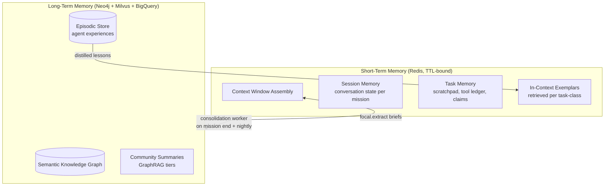
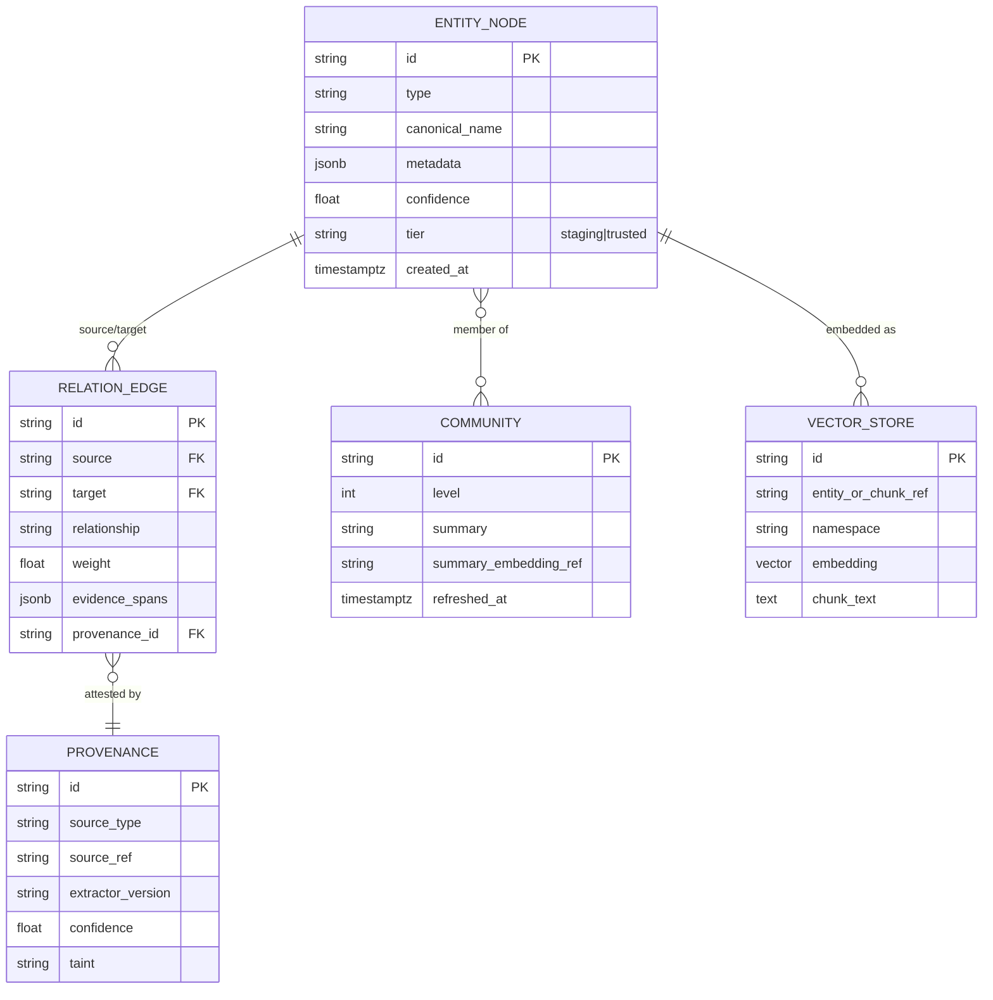

# Phase 4 — Knowledge Graph & Memory Architecture

> RFC-001 · Section 4 · Status: Draft

## 4.1 Dual-Memory Overview



### Short-term memory

- **Context window assembly:** every agent prompt is *built*, never accreted: system role + ARS excerpt + focal graph rendering + task memory summary + last-k tool results. The assembler enforces token budgets per segment, evicting by recency×relevance. Prompts are content-hashed and logged (constraint: every prompt audited).
- **Session memory:** per-mission conversational state (decisions made, open questions, dissents), summarized progressively (map-reduce summarization at 70% budget).
- **Task memory:** structured scratchpad — `{hypotheses[], attempts[], tool_ledger[], claims[]}` — stored in Redis with Postgres checkpoint mirror (survives pod death; feeds claims sheet generation).
- **In-context learning:** the exemplar service retrieves the 2–3 most similar *successful* past episodes for the task class (from the episodic store) and injects them as few-shot guidance. This is how the swarm "learns" without fine-tuning.

### Long-term memory

Consolidation worker promotes: task outcomes → episodic nodes; validated claims →
semantic graph edges; failure patterns → anti-pattern nodes that the exemplar service
surfaces as warnings. Confidence decays with age unless re-confirmed (`confidence(t) =
c₀ · e^(−λ·Δt)`, λ per relation type) so stale market "facts" fade without deletion.

## 4.2 GraphRAG Architecture

**Ingestion → graph pipeline** (Temporal workflows, Python workers):

1. **Acquire & parse** — connector pulls document; layout-aware parse (sections, tables, figures, equations, references).
2. **Chunk & embed** — semantic chunking (section-aware, ~512–1024 tokens, 15% overlap); embeddings → Milvus (namespace per modality/tenant).
3. **Entity extraction** — LLM extraction with the ontology as a typed schema (constrained JSON output): Methods, Materials, Metrics, Datasets, Claims, Authors, Institutions, Companies, Products, Technologies, Symbols.
4. **Relationship extraction** — typed relations with evidence spans: `IMPROVES_ON`, `EVALUATED_ON`, `CONTRADICTS`, `CITES`, `IMPLEMENTS`, `COMPETES_WITH`, `DEPENDS_ON`, `SIGNALS_DEMAND_FOR`…
5. **Entity resolution** — blocking (name+type+embedding ANN) → pairwise LLM adjudication → merge above 0.95 precision threshold, else `SAME_AS?` candidate edge for human curation queue.
6. **Graph upsert** — into **staging tier** with full provenance; promotion to trusted tier per §4.5.
7. **Community detection** — incremental Leiden; hierarchical communities (L0 leaf → L2 domain) each get an LLM-written summary, re-summarized on ≥20% membership churn.

### Ontology (top level)

| Layer | Node types | Notes |
|---|---|---|
| Research graph | `ResearchPaper`, `Claim`, `Method`, `Dataset`, `Metric`, `Author`, `Institution` | citation graph = `CITES` edges + influence scores |
| Code graph | `Repository`, `CodeBlock` (symbol-level), `Interface`, `Dependency`, `TestCase`, `SoftwareArtifact` | built from AST/SCIP, §5 |
| Market graph | `Company`, `Product`, `MarketSignal`, `Segment`, `Need` | warehouse aggregates promoted as nodes |
| Platform graph | `Opportunity`, `Hypothesis`, `ARS`, `Task`, `DeploymentRecord`, `AgentEpisode` | the platform's own activity is queryable knowledge |

Cross-layer edges are where arbitrage lives: `Method —IMPLEMENTABLE_AS→ CodeBlock`,
`Claim —ADDRESSES→ Need`, `MarketSignal —SIGNALS_DEMAND_FOR→ Method`.

## 4.3 ER Diagram (knowledge core)



## 4.4 Focal Graph Generation

A **Focal Graph** is the minimal, ranked, *explained* subgraph sufficient for one task —
the antidote to both context-window stuffing and lossy community summaries.

**Algorithm (focal.extract):**

```
1. SEED      Resolve query → seed set S:
             vector ANN top-k (Milvus) ∪ exact entity matches ∪ caller-provided seeds.
2. EXPAND    Personalized PageRank from S over the typed graph, with
             edge-type weights conditioned on `purpose`
             (e.g. code_task_brief upweights DEPENDS_ON/IMPLEMENTS;
              opportunity_mining upweights CONTRADICTS/SIGNALS_DEMAND_FOR).
             Cap frontier at max_nodes × 4 candidates.
3. SCORE     relevance(n) = α·PPR(n) + β·cos(emb(n), emb(query))
                          + γ·provenance_confidence(n) + δ·recency(n)
             (α..δ per purpose; learned-to-rank model replaces linear blend post-Alpha — OQ-1)
4. PRUNE     Steiner-tree connect: keep highest-scoring nodes that remain
             connected to ≥1 seed within 3 hops; drop dangling low-score nodes;
             collapse parallel edges; enforce max_nodes and token_budget.
5. EXPLAIN   For each kept node: why_included = path-to-seed + score factors.
             Emit coverage_note listing top-5 pruned candidates and reason.
6. RENDER    Serialize as typed adjacency text + node summaries within token_budget.
```

Explainability is structural: the UI (§8.2) renders `why_included` per node, and the
coverage note tells reviewers what the agent *didn't* see — critical for auditing
agent decisions and for the Copilot-Paradox claims-sheet review.

## 4.5 Trust Tiers (poisoning defense)

`staging` (all automated writes) → `trusted` (promotion when: provenance confidence ≥
threshold ∧ corroborated by ≥2 independent sources ∨ human-curated). Focal extraction
over `trusted` by default; agents may request staging inclusion, which taints the
resulting brief and downgrades allowed Action tools (§7.6).

## 4.6 RAG vs GraphRAG vs Focal Graph

| Criterion | Standard RAG | GraphRAG (community summaries) | Focal Graph (chosen for tasks) |
|---|---|---|---|
| Retrieval unit | Text chunks | Community summaries + chunks | Ranked typed subgraph |
| Multi-hop questions | Weak | Good (global) | Strong (local+global, typed paths) |
| Cross-domain arbitrage | Poor | Moderate | Strong — typed cross-layer edges are the signal |
| Token cost / query | Low | Medium–high | Medium (budgeted by construction) |
| Explainability | Citations only | Summary lineage | Per-node why_included + coverage note |
| Build cost | Embeddings only | + extraction + communities | + ranking infra |
| Query latency | ~50–200 ms | ~0.5–2 s | ~1–4 s (cacheable per task) |
| Failure mode | Misses structure | Summary staleness/hallucination | Bad seed → bad graph (mitigated by hybrid seeding) |

**Decision:** all three coexist. RAG for cheap lookups (`vector.search`), GraphRAG
community summaries for global "state of domain X" questions, Focal Graph for every
agent task brief and every human review artifact.

**Complexity & scale:** ingestion is embarrassingly parallel (per-document). Entity
resolution is the bottleneck — O(n²) naïvely; blocking reduces to near-linear with
ANN candidate generation. Incremental Leiden avoids full recompute (full pass weekly).
PPR via approximate push algorithm is O(1/ε) per query, independent of graph size —
this is why Focal Graph stays interactive at TB scale. Graph partitions by tenant,
then by domain layer; cross-partition edges via reference stubs (§9.3).

---

*Next: [Section 5 — Autonomous Software Engineering Workflow](05-ase-workflow.md)*
