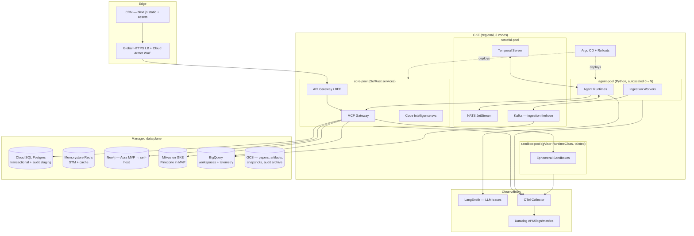

# Phase 6 — Infrastructure Architecture

> RFC-001 · Section 6 · Status: Draft
> Cloud: **GCP** (BigQuery affinity, GKE maturity, TPU optionality). All modules cloud-portable behind Terraform abstractions.

## 6.1 Deployment Diagram



## 6.2 Compute Decisions

| Workload | Substrate | Why |
|---|---|---|
| API/gateway/code-intel | GKE `core-pool`, Go/Rust | Latency-sensitive, steady load |
| Agent runtimes | GKE `agent-pool`, KEDA-scaled on NATS queue depth, spot-friendly | Bursty; checkpointed agents tolerate preemption |
| Sandboxes | `sandbox-pool`, gVisor RuntimeClass (MVP) → Firecracker microVMs (Enterprise); node taints; no service account | Untrusted code; hard isolation; scale-to-zero |
| Analytics | BigQuery (serverless) | TB-scale scans without cluster ops; per-tenant datasets = "workspace" model |
| Ingestion parsing | Cloud Run jobs | Embarrassingly parallel, scale-to-zero |

**Autoscaling:** HPA (CPU/latency) for core; KEDA on queue depth for agents/ingestion;
cluster autoscaler with spot node pools for agents/sandboxes (60–80% cost cut on the
dominant compute); Balloon pods keep one warm sandbox node per zone (p95 task start < 15 s).

**Storage/compute separation:** every stateful system stores to detachable media —
BigQuery natively; Milvus segments + Neo4j backups + workspace snapshots on GCS;
Kafka tiered storage. Compute is cattle everywhere; this is what makes zero-downtime
node upgrades and cell evacuation routine.

## 6.3 Sandboxing (defense-in-depth detail in §7)

- Ephemeral pod per `code.execute`; workspace mounted from snapshot (overlayfs), diff captured as new snapshot — agent code never touches shared volumes.
- Default-deny NetworkPolicy; `network: package_registries` mode routes only via an egress proxy to allowlisted registries (with dependency-confusion screening).
- No K8s service account token mounted; no secrets present; resource limits + 30-min hard wall.

## 6.4 Eventing, Queues, Caching

| Channel | Tech | Used for |
|---|---|---|
| Agent coordination (A2A/ACP envelopes) | NATS JetStream | Low-latency, durable, per-mission streams, replayable for audit |
| Ingestion firehose | Kafka | High-throughput document/signal/telemetry streams into BigQuery + graph pipeline |
| Durable orchestration | Temporal | Mission/deploy/ingestion workflows — retries, timers, compensation |
| Cache | Redis | STM, focal-graph cache (keyed by query+graph-version), embedding cache, tool-result memoization (Perception only — never Action) |

**Why both NATS and Kafka:** different shapes — NATS for many small ordered
conversational streams with consumer acks; Kafka for partitioned firehose throughput
and warehouse connectors. Collapsing to one was evaluated and rejected: Kafka adds
~10× operational weight for the coordination case; NATS underperforms for TB ingestion.

## 6.5 Observability

- **Tracing:** OpenTelemetry everywhere; the `mission_id`/`task_id`/`agent_id` baggage propagates from UI click → workflow → agent → MCP call → sandbox → deploy. One trace tells a change's whole story.
- **LLM telemetry:** LangSmith for prompt/completion traces, token spend per mission/agent/task-class, eval scores; sampled human-rated quality.
- **Metrics (Datadog):** golden signals per service + platform-specific: tasks in flight, bid latency, lease expiries, validation pass rate, autonomy-mode distribution, canary aborts, graph staging backlog, $/merged-change.
- **Logging:** structured JSON, trace-correlated → Datadog (30 d hot) + GCS (long-term). Audit events are a separate hash-chained stream (§7.8) — observability logs are *not* the audit system.
- **Alerting:** SLO burn-rate alerts (multi-window); agent-specific pages: validation pass rate drop, reviewer catch-rate drop (Copilot-Paradox sentinel), budget anomaly, sandbox policy-violation spike.

## 6.6 Zero-Downtime Machinery

Argo Rollouts canary (default) with automated metric analysis; blue/green for
stateful-adjacent services; PodDisruptionBudgets + surge upgrades on node pools;
expand-migrate-contract schema discipline (§5.4); connection-draining LB. Releases are
immutable digests; config via versioned ConfigMaps cut over with the rollout.

## 6.7 IaC Organization (Terraform primary, Pulumi for dynamic edges)

```
infra/
├── terraform/
│   ├── modules/
│   │   ├── network/          # VPC, subnets, egress proxy, Cloud Armor
│   │   ├── gke/              # cluster, node pools (core/agent/sandbox/stateful)
│   │   ├── data/             # cloudsql, memorystore, bigquery datasets, gcs
│   │   ├── graph/            # neo4j (aura tf provider → self-host module)
│   │   ├── vector/           # milvus-on-gke helm wrapper
│   │   ├── messaging/        # kafka (strimzi), nats
│   │   ├── observability/    # datadog, otel-collector, alert policies
│   │   └── security/         # vault, workload identity, KMS, audit sinks
│   ├── envs/
│   │   ├── dev/  staging/  prod/        # thin composition roots, remote state per env
│   └── global/               # org policies, DNS, artifact registry
├── pulumi/
│   └── tenant-provisioner/   # TypeScript: dynamic per-tenant resources
│                             # (BigQuery dataset, graph partition, namespaces)
└── kubernetes/
    ├── base/                 # kustomize bases per service
    ├── overlays/{dev,staging,prod}/
    └── argocd/               # app-of-apps definitions
```

**Terraform vs Pulumi decision:** Terraform for the static estate (review-friendly HCL,
mature GCP provider, drift detection in CI). Pulumi (TypeScript) only where resources
are created *programmatically at runtime* — tenant provisioning — because that path is
invoked by the Infrastructure Service API, not by an engineer. Plans for both are
surfaced as HITL approvals when the Infra Agent is the author (`infra.apply` gate).

---

*Next: [Section 7 — Security & Governance](07-security-governance.md)*
