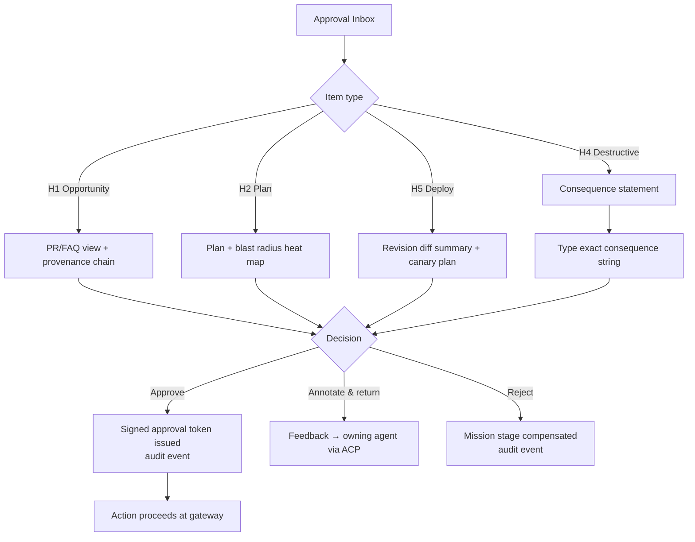
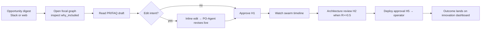

# Phase 8 — User Experience

> RFC-001 · Section 8 · Status: Draft
> Stack: Next.js + TypeScript; React Flow + WebGL for graph canvases; Yjs + WebSockets for live multiplayer; Tailwind; event streams over the same NATS-backed websocket bridge that powers agent telemetry.

## 8.1 Omni-Channel Model

One workspace app + thin channels. Every channel action round-trips through the same
APIs (§10), so approvals from Slack and from the web app are identical audit-wise.

| Channel | Capabilities |
|---|---|
| Web workspace | Everything (canonical) |
| Slack/Teams chat-ops | Approve/deny (H1/H5 with consequence echo), mission status, opportunity digests |
| Email | Digests + deep links (no in-email approval for destructive ops) |
| Mobile PWA | Approval inbox, execution dashboard (read), incident pages |
| API/CLI | Power-user automation; same RBAC |

## 8.2 Surfaces

1. **Interactive Focal Graph Visualization** — WebGL canvas of any focal graph: nodes colored by domain layer, sized by relevance; hovering shows `why_included`; the pruning panel renders the `coverage_note` ("what the agent didn't see"). Time-slider replays graph state at decision time — the explainability workhorse.
2. **Swarm Activity Timeline** — live Gantt per mission: agents as lanes, tasks as bars, A2A/ACP message ties, tool calls as ticks; click-through to LLM trace (LangSmith deep link) and audit events.
3. **Architecture Review Workflow** — H2 surface: plan, task DAG, blast-radius heat map over the service topology, claims sheet; approve / annotate-and-return / reject.
4. **Research Explorer** — search + citation-graph navigation; contradiction views (`CONTRADICTS` edges); "promote to opportunity seed" action.
5. **Code Explorer** — symbol-level code graph, dependency views, agent-authored diff review with claims-sheet-first layout (diff is secondary, per §1.7).
6. **Autonomous Execution Dashboard** — operator view: live rollouts with canary metrics, soak status, rollback button (pre-authorized), swarm pause control per service.
7. **Innovation Dashboard (70/20/10)** — portfolio allocation across core (70%), adjacent (20%), experimental (10%): spend, mission count, validated-insight yield, $/merged-change per track; rebalance proposals from BI-Agent appear here for strategist approval.
8. **HITL Approval UI** — unified inbox; each item shows action, risk score, blast radius summary, provenance chain, and for destructive ops the **typed-consequence field** (user must type the consequence, e.g. the dataset name to be deleted).

## 8.3 UI Flow — Approval Inbox

## 8.4 UI Flow — Opportunity to Mission (strategist journey)

## 8.5 Design Principles

- **Explainability before action:** no approval button is reachable without the provenance/blast-radius panel having rendered (enforced in the client *and* by token issuance requiring the evidence bundle ID).
- **Progressive disclosure:** strategists see narratives; architects see graphs and DAGs; operators see metrics — same underlying mission object.
- **Latency budget:** approval-critical views ≤ 2 s p95 (focal-graph cache, §6.4); the canvas streams nodes progressively.
- **Multiplayer:** Yjs CRDT on review annotations and ARS edits — humans and PO-Agent co-edit the same document with attributed cursors.

---

*Next: [Section 9 — Database Design](09-database.md)*
