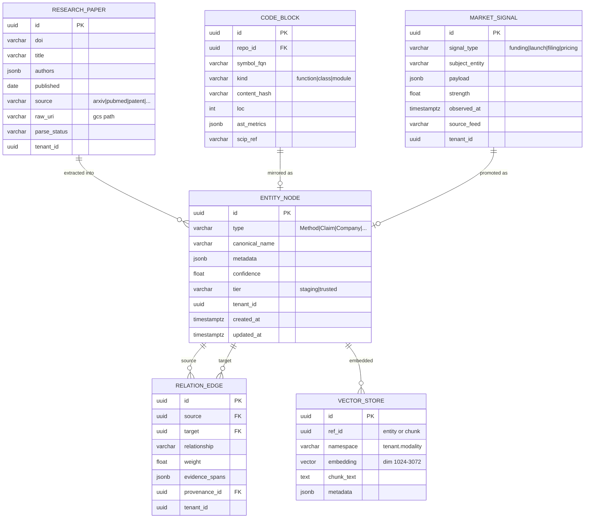
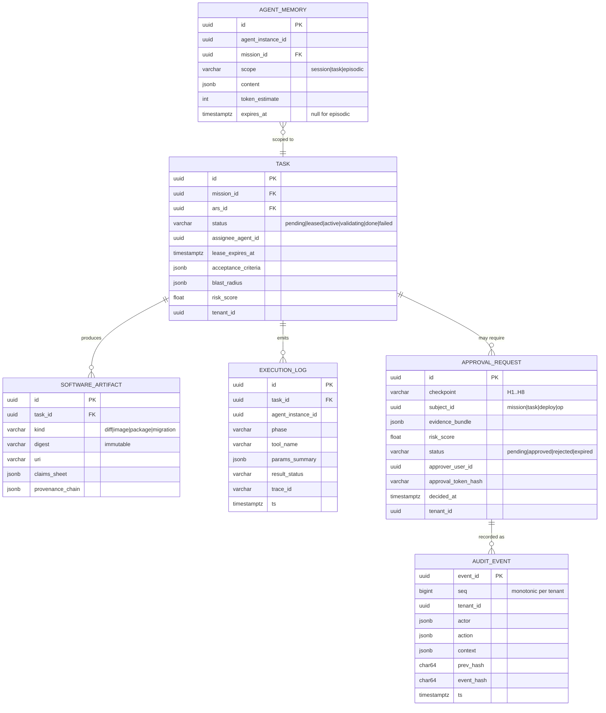

# Phase 9 — Database Design

> RFC-001 · Section 9 · Status: Draft
> Polyglot persistence: **Neo4j** (graph) · **Milvus** (vectors) · **PostgreSQL** (transactional/state/audit staging) · **BigQuery** (analytics/telemetry) · **GCS** (blobs/WORM audit). Each entity has exactly one system of record; others hold projections.

## 9.1 Entity Placement

| Entity | System of record | Projections |
|---|---|---|
| EntityNode, RelationEdge | Neo4j | BigQuery (analytics mirror, daily export) |
| VectorStore | Milvus | — |
| ResearchPaper | GCS (raw) + Neo4j (node) | BigQuery metadata table |
| CodeBlock | Neo4j (code graph) | Milvus (symbol embeddings) |
| MarketSignal | BigQuery | Neo4j (promoted aggregates) |
| SoftwareArtifact, Task, ApprovalRequest | PostgreSQL | Neo4j (platform graph nodes) |
| AgentMemory | Redis (hot) + PostgreSQL (checkpoint) | Neo4j episodic (consolidated) |
| ExecutionLog | BigQuery (volume) | — |
| AuditEvent | PostgreSQL staging → GCS WORM | BigQuery (query mirror) |

## 9.2 ER Diagrams

### Knowledge core

### Execution & governance core

## 9.3 Indexing Strategy

| Store | Index | Purpose |
|---|---|---|
| Neo4j | btree on `:Entity(id)`, composite `(tenant_id, type)`, `(tenant_id, canonical_name)` | lookups, tenant scoping |
| Neo4j | full-text on `canonical_name, aliases` | seed resolution |
| Neo4j | relationship index on `relationship` + `weight` | typed traversal (PPR) |
| Milvus | HNSW (M=16, efC=200) per namespace; scalar filters on `tenant`, `modality`, `tier` | ANN with filtered search; IVF_PQ for cold namespaces |
| Postgres | `task(status, lease_expires_at)` partial index on active statuses | scheduler scans |
| Postgres | `approval_request(tenant_id, status) WHERE status='pending'` | inbox |
| Postgres | `audit_event(tenant_id, seq)` unique; BRIN on `ts` | chain verification, range scans |
| BigQuery | partition `execution_log`/`telemetry`/`market_signal` by `DATE(ts)`, cluster by `(tenant_id, mission_id)` / `(tenant_id, signal_type)` | scan-cost control |

## 9.4 Partitioning Strategy

- **Tenant first, everywhere.** Postgres: `tenant_id` columns + RLS policies (MVP) → schema-per-tenant for large tenants. Neo4j: logical partition via tenant label + composite indexes (MVP) → database-per-tenant (Enterprise, also the VPC story). Milvus: collection-per-tenant above size threshold, partition-key below. BigQuery: dataset-per-tenant ("workspace"), per-dataset quotas.
- **Within tenant:** graph partitions by domain layer (research/code/market/platform); cross-layer edges are first-class but counted — a layer-cut metric guards against pathological fan-out. Time-partition everything event-shaped (BigQuery native; Postgres `pg_partman` monthly on `execution_log`, `audit_event` staging).

## 9.5 Scaling Strategy

| Store | 1 TB → 10 TB+ path |
|---|---|
| Neo4j | Aura (MVP) → self-hosted causal cluster: 1 writer + read replicas; analytics offloaded to BigQuery mirror; if write ceiling hit → evaluate sharded property graph or layer-split databases |
| Milvus | Pinecone (MVP) → Milvus on GKE: segment-based scale-out on GCS; QPS via querynode autoscaling; tiered: hot HNSW in memory, cold IVF_PQ on disk |
| Postgres | Vertical first (transactional volume is modest) + read replicas; partition pruning; audit volume routed to WORM/BigQuery so Postgres stays small |
| BigQuery | Native serverless; cost control = partition discipline + per-tenant byte quotas + materialized views for dashboard queries |
| Redis | Memorystore cluster mode; STM is TTL-bound so working set stays flat per concurrent mission |

Capacity anchor (Enterprise design point): 100 tenants × 10 concurrent missions ×
10 agents ≈ 10k concurrent agent contexts; ~5k tool calls/s at gateway (Go, horizontally
trivial); graph ~10⁹ nodes / 10¹⁰ edges aggregate — within partitioned-Neo4j +
PPR-push envelope per §4.6.

---

*Next: [Section 10 — APIs](10-apis.md)*
