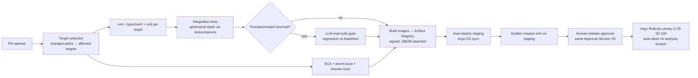

# Phase 11 — Repository Organization

> RFC-001 · Section 11 · Status: Draft

**Decision: single monorepo** (Bazel-lite via Turborepo + per-language toolchains).
Rationale: atomic cross-service changes (proto + server + client + infra in one PR),
single blast-radius index over our own code (we dogfood `blast.analyze` on it), one CI
policy surface. Trade-off vs polyrepo: heavier CI tooling up front; accepted — selective
builds keep CI O(changed targets).

## 11.1 Layout

```
r2p-ip/
├── README.md
├── docs/
│   ├── rfc/                      # this RFC (00–12)
│   ├── adr/                      # architecture decision records
│   └── runbooks/
├── proto/                        # single source of truth for gRPC/eventing schemas
│   └── r2pip/{agent,graph,memory,planning,execution,audit,approval}/v1/
├── backend/                      # Go/Rust core services
│   ├── gateway-mcp/              # Go: MCP gateway + OPA integration
│   ├── api-bff/                  # Go: REST BFF for frontend
│   ├── code-intel/               # Rust: tree-sitter/SCIP indexing, blast radius
│   ├── audit/                    # Go: hash-chain, WORM sealing
│   └── approval/                 # Go: token issuance/verification
├── agents/                       # Python (FastAPI workers on Temporal)
│   ├── runtime/                  # lifecycle, checkpointing, budget governor
│   ├── po/  bi/  head_engineer/  developer/  qa/  infra/
│   ├── protocols/                # A2A cards, ACP envelopes, contract-net
│   └── prompts/                  # versioned prompt packs (evaluated like code)
├── knowledge/                    # ingestion & extraction (Python)
│   ├── connectors/               # arxiv, pubmed, patents, market feeds, github
│   ├── parsing/  extraction/  resolution/   # layout parse, NER/RE, entity resolution
│   └── pipelines/                # Temporal ingestion workflows
├── graph/                        # graph platform (Python/Go)
│   ├── ontology/                 # schema-as-code, migration tool
│   ├── graphrag/                 # communities, summaries
│   └── focal/                    # focal graph engine (PPR, ranking, pruning)
├── memory/                       # memory service: STM assembly, consolidation, exemplars
├── api/                          # OpenAPI specs, generated clients (ts/py/go)
├── frontend/                     # Next.js workspace app
│   ├── apps/workspace/
│   └── packages/{ui,graph-canvas,approval-kit,timeline}/
├── infra/                        # per §6.7
│   ├── terraform/{modules,envs,global}/
│   ├── pulumi/tenant-provisioner/
│   └── kubernetes/{base,overlays,argocd}/
├── pipelines/                    # CI/CD definitions (see 11.2)
│   ├── ci/                       # per-area workflow templates
│   └── cd/                       # argo app definitions, rollout analysis templates
├── tests/
│   ├── e2e/                      # mission-level scenario tests (golden missions)
│   ├── evals/                    # LLM eval suites: extraction F1, codegen pass@k,
│   │                             #   injection red-team, focal-graph ranking benchmarks
│   └── load/                     # k6/gatling profiles
├── examples/                     # sample corpora, demo missions, sandbox playground
├── scripts/                      # dev bootstrap, local stack (docker compose), data seeds
└── tools/                        # repo tooling: codegen, lint configs, ownership map
```

`CODEOWNERS` mirrors the ownership map consumed by `blast.analyze` — one file, two
consumers (humans and agents).

## 11.2 CI/CD Organization



CI rules of note:

- **Evals are CI.** Prompt or model-routing changes cannot merge without the eval gate (§7.8) — treated identically to failing unit tests.
- **Agent-authored PRs** run the *same* pipeline plus claims-sheet verification and provenance check; the platform's own approval service gates its own releases (dogfooding H5).
- **Supply chain:** images signed (cosign), SBOM (syft) attached, admission controller verifies signatures in-cluster.
- **Infra changes:** `terraform plan` posted to PR; `apply` only from main via pipeline identity; Infra-Agent-initiated changes route through the Infrastructure Service HITL path instead — humans and pipelines never share credentials with agents.
- **Zero-downtime release train:** staging continuously, production on approval; no Friday-freeze needed because rollback is < 60 s (§5.4) — but H5 remains human-gated until autonomy metrics justify supervised-mode releases for R < 0.2 services (roadmap Phase 4).

---

*Next: [Section 12 — Phased Roadmap](12-roadmap.md)*
