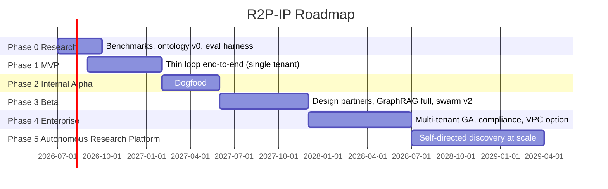

# Phase 12 — Phased Roadmap

> RFC-001 · Section 12 · Status: Draft
> Durations assume funded team, frontier-model API access, and the MVP thesis from §0.7 as the north star.

## 12.1 Overview

## 12.2 Phase Detail

| | P0 Research | P1 MVP | P2 Internal Alpha | P3 Beta | P4 Enterprise | P5 Autonomous |
|---|---|---|---|---|---|---|
| **Duration** | 3 mo | 5 mo | 4 mo | 6 mo | 7 mo | 9+ mo |
| **Team** | 4 (2 AI/ML, 1 platform, 1 founder-arch) | 8 (+2 backend, +1 fe, +1 infra) | 12 (+2 agents, +1 QA/evals, +1 design) | 18 (+graph team 2, +security 1, +PM, +2 eng) | 26 (+SRE 2, +compliance 1, +solutions 2, +3 eng) | 30–35 |
| **Focus** | De-risk OQ-1/2/4; eval harness; ontology v0; focal-graph prototype offline benchmarks | §0.7 scope: star-topology agents, vector RAG + light graph, gVisor sandbox, audit v1, approval inbox, one stack | Platform builds its own features; calibrate autonomy thresholds with real defect data; A2A contract-net v1 | 5–10 design partners; full GraphRAG + focal engine; brownfield repos; Milvus migration; mobile approvals | Multi-tenancy hardening, SOC 2 Type II, ISO 42001 prep, VPC/self-host, Firecracker, marketplace connectors | BI-Agent self-directed hypothesis portfolios; cross-tenant (opt-in) knowledge federation; supervised-mode releases |
| **Key dependencies** | Model API access; corpora licenses (OQ-8) | P0 eval harness; Temporal + GKE foundation | P1 stable loop; ≥50 merged missions of calibration data | Alpha defect-escape ≤ target; entity resolution ≥0.95 precision (OQ-4) | Beta retention; audit WORM + compliance exports proven | P4 trust metrics; regulator landscape (EU AI Act audits) |
| **Major risks** | Focal ranking no better than RAG (R6/OQ-1) | Scope creep past thin loop; token costs (R4) | Dogfood bias — platform overfits to building itself | Brownfield blast-radius accuracy; partner data licensing | Tenancy isolation bugs (critical); cost of compliance | Autonomy incidents → reputational/regulatory (R9) |
| **Tech-debt policy** | Throwaway allowed (research code) | Debt ledger starts; no debt in audit/approval paths ever | 20% capacity to debt; replace P1 shortcuts (RLS, star topology) | Graph partition refactor; prompt-pack consolidation | Debt freeze before SOC 2 audit window | Continuous 15% allocation |
| **Milestone (exit)** | Focal Graph beats RAG baseline ≥15% on synthesis benchmark; go/no-go | **First fully-audited mission: research corpus → deployed service with HITL gates, < 5 days wall-clock** | 30% of platform's own merged PRs agent-authored at supervised mode, defect-escape ≤ human baseline | 3 partners with weekly active missions; NPS ≥ 40; $/merged-change ≤ 0.5× human cost | 10 paying tenants; SOC 2 Type II; 99.9% SLO; zero cross-tenant incidents | ≥1 product increment/month per tenant originating from autonomous discovery (stage 13 loop) |
| **Success metrics** | Benchmark deltas; extraction F1 ≥ 0.85 | Mission success rate ≥ 70%; audit completeness 100% | Autonomy calibration curve stable; reviewer catch-rate ≥ 90% | Validated-insight yield/tenant/mo; retention | ARR, gross margin (LLM cost ≤ 25% rev), uptime | Discovery precision (shipped/proposed ≥ 30%); incident-free autonomous merges |

## 12.3 Hiring Sequence Rationale

AI/agents engineers front-loaded (the loop is the product); graph specialists at P3
(when GraphRAG becomes the moat, not before — MVP proves the loop with simpler
retrieval); security/compliance at P3→P4 boundary (before enterprise sales, after
product-market signal); SRE when SLOs become contractual.

## 12.4 Standing Risk Posture Through Phases

Autonomy expands only when **measured** trust does: each phase exit requires the
defect-escape and reviewer-catch-rate gates from §1.7 at the *current* autonomy level
before thresholds loosen. Any Sev-1 caused by an autonomous action freezes threshold
expansion for one full phase. This is the governance contract that makes the rest of
the RFC sellable to enterprises and defensible to regulators.

---

*End of RFC-001. Return to [README](../../README.md).*
